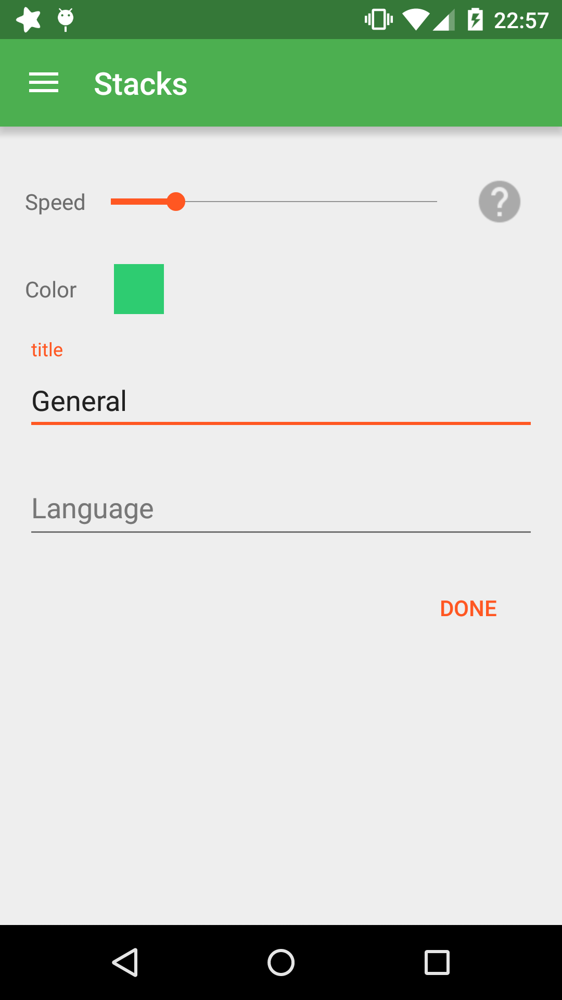
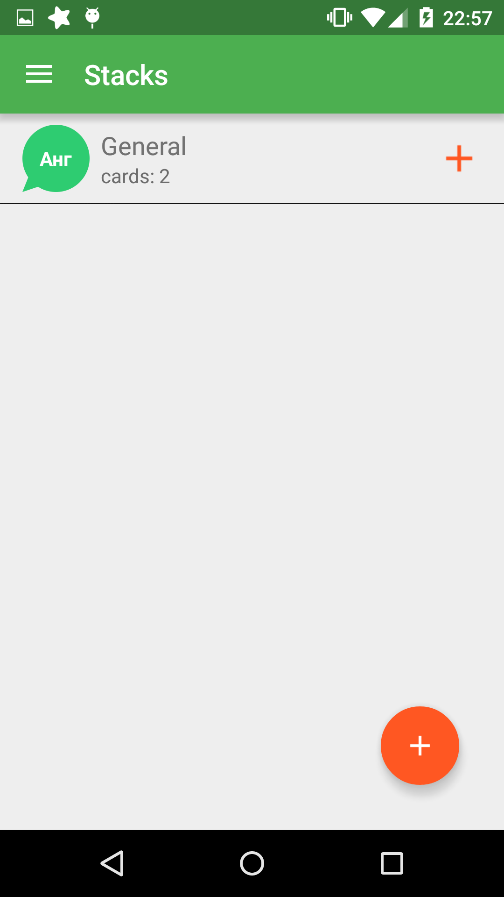
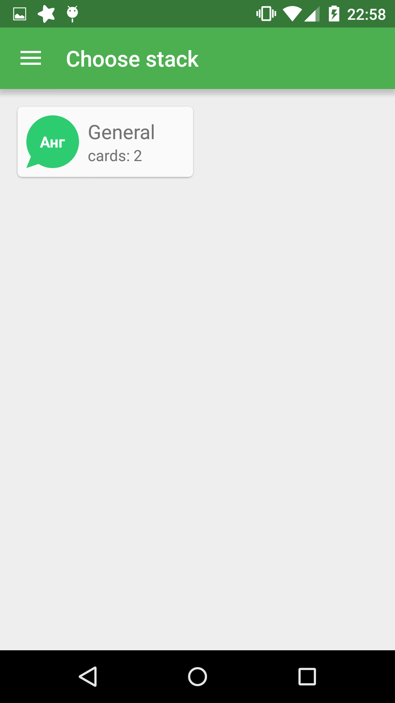
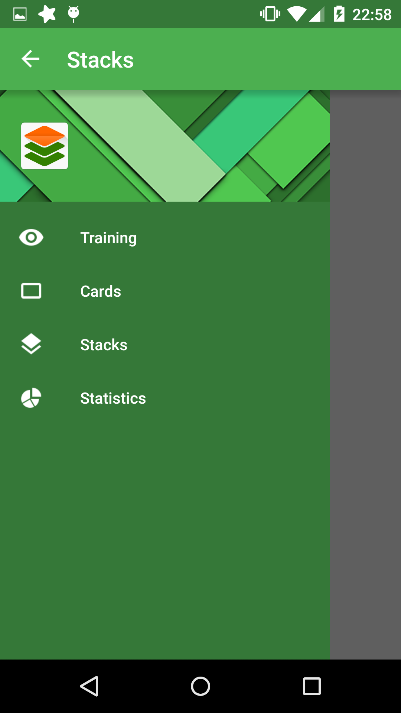
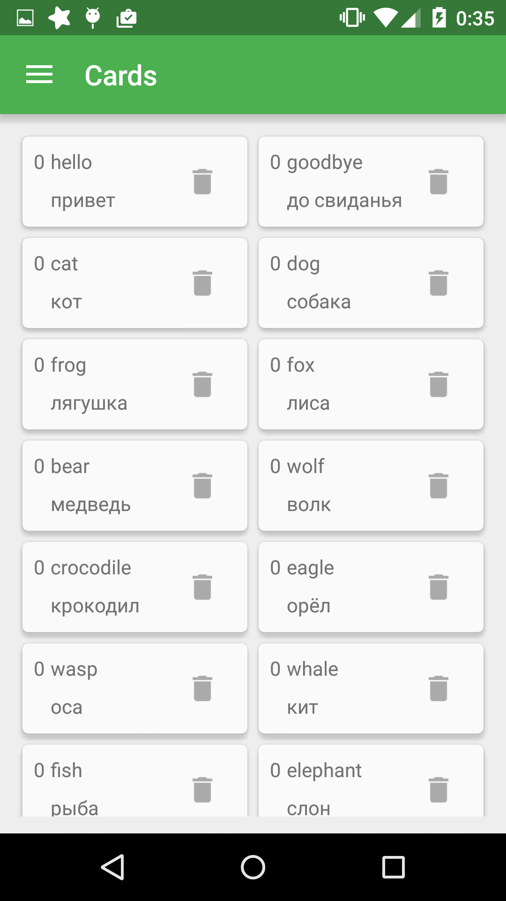
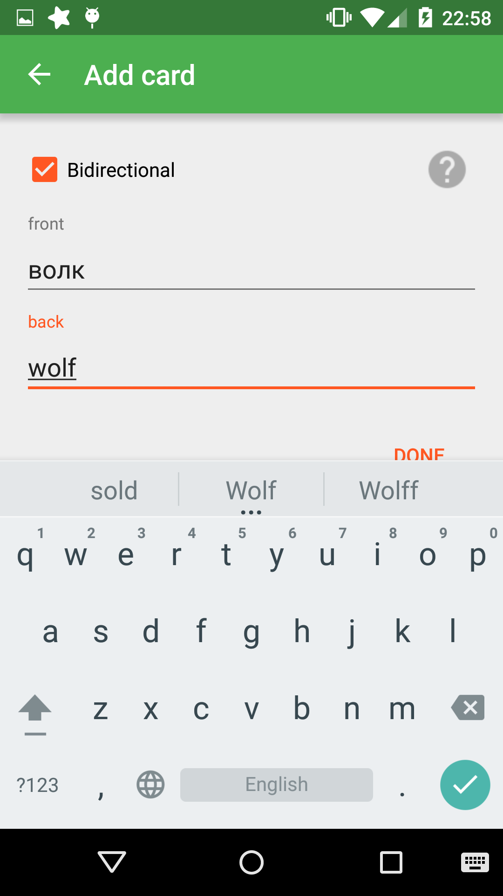
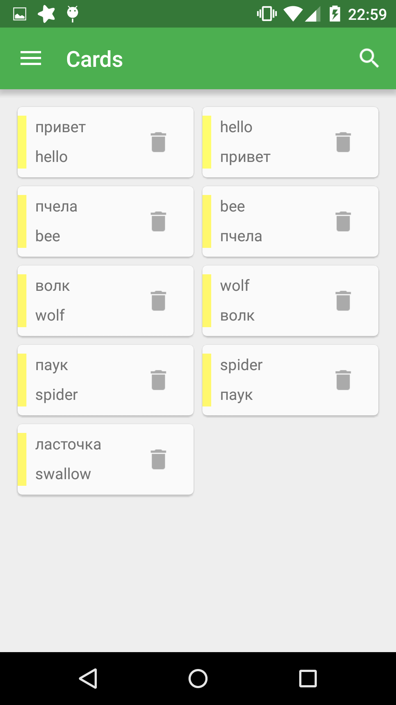
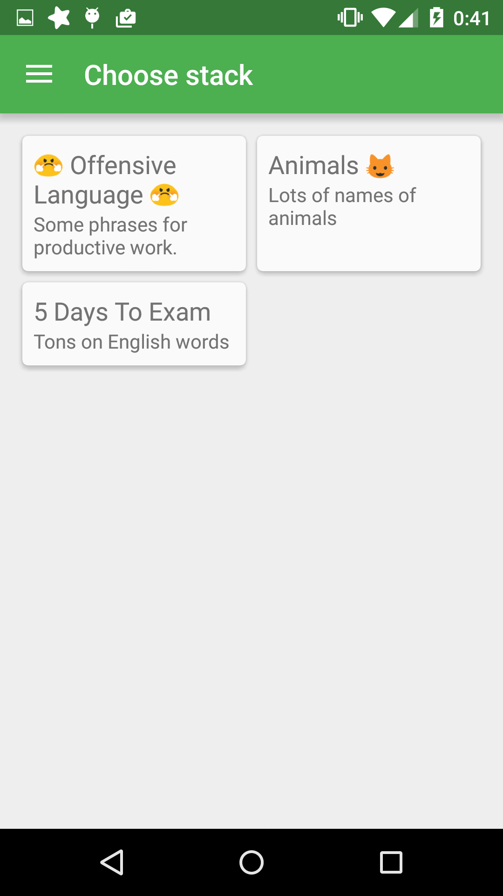

# Stacks

Current stage
---

And <a href="./activity_navigation_hierarchy.png">here</a> you can see navigation hierarchy.

This project was created for educational purposes. (probably not only)

**Stacks** is application for Android. It is similar to anki droid, but I am going to
create a better design and another algorithm of studying and probably support of different ways of
studying like in LinguaLeo.

How I see it for now
---

You create stacks which collect cards. Cards are cards in other words  some objects that
have two sides where user can write on. User will see only one side of card. It is called front
side. Another side which user will not see has translation of front side and is called back side.
Each card has property called progress. This value symbolizes the degree of knowing of each card.
It is integer value belonging to some neighbourhood of zero(e.g. -25 <= progress <= 25). Initial
value is 0. If progress is on the bottom limit it cannot become less. And if progress becomes equal
to the top limit the card disappears from stack and moves into the extra stack of learned
cards. Each time user guesses back side of card progress increases. Each time user makes mistake
it decreases. But this happens only once per day. So user can be training cards for the whole day
but it will not make application to think that the user have learned all cards. It's logical and
easy to implement(so naive XD). I think such form of progress is good because of two reasons. In
case user knows a card he will not spend a lot of days repeating it. But from the other side if
user faces with troubles during learning a card he will not decrease progress to the big negative
value. So user do not have to repeat this card a whole year to the app would mark it as learned.
But anyway the user needs to try hard to learn it if he faced with problems in memorizing the card.

So when a user opens app with intent to repeat cards what happens. The app shows the front side to
user. And the user needs to write down in the editable field below the variant of the back side
inscription. According to the success or fail app will change progress of the shown card.

*Glad to hear opinions and ideas.*

Build
---

I use Android Studio. Hence you can easily import this project using menu File>Open Project. I have
not tried yet but it seems so. Anyway if you have any trouble in importing write me email and I will
try to help you.
