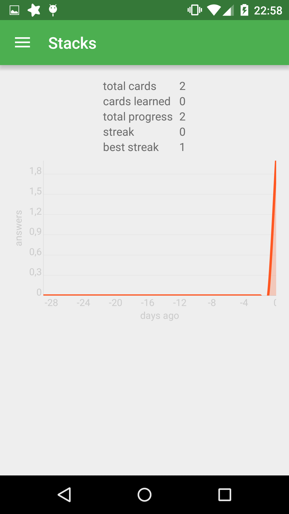

# Stacks

Current stage
---

This project was created for educational purposes. (probably not only)

**Stacks** is application for Android. It is similar to anki droid, but I am going to
create a better design and another algorithm of studying and probably support of different ways of
studying.

How I see it for now
---

I decided to create implementation for [Leitner system](https://en.wikipedia.org/wiki/Leitner_system).
It's the system of spaced repetition based on boxes. There are 5 boxes. They symbolize proficiency
level of cards that inside of them. 1st box is reviewed every day, 2nd every two days and so forth.
If user remembered card in the box the card is moved into next box. Otherwise the card will be moved
into first box. After 5th box the card is learned.

*Glad to hear opinions and ideas.*

Build
---

I use Android Studio. Hence you can easily import this project using menu File>Open Project. I have
not tried yet but it seems so. Anyway if you have any trouble in importing write me email and I will
try to help you.
